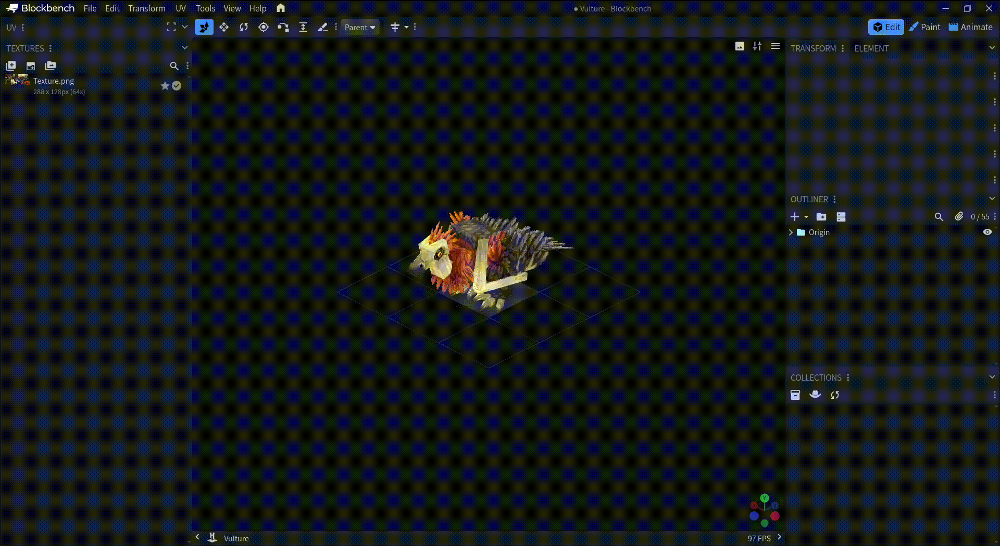

# Hytalewiki.gg Blockbench plugin

## Actions

### Importing models


`Import Hytale Mob Model` \
`Import Hytale Item Model`

Select the base model folder from assets `Common/NPC/Swimming_Wildlife/Whale_Humpback/` for mobs. `Common/Items/Brush/` for Items.

For mobs imports all models, animations, textures.

For items, imports all variants and their textures. [!] Sometimes the last imported model has the wrong texture selected.

### Importing / exporting angle presets

`Import Angle Presets` \
`Export Angle Presets`

Import and export angle presets through JSON.

Angle preset `hytalewiki`:
```
[
  {
    "name": "hytalewiki",
    "projection": "unset",
    "position": [
      -512,
      426.05,
      -512
    ],
    "target": [
      0,
      8,
      0
    ],
    "zoom": 0.05369660578660063
  }
]
```

### Taking predefined screenshots



`Take Hytalewiki Screenshot`

Takes a screenshot with angle preset `hytalewiki`, then auto crops and adds 20px of padding around the model.

### Automatic screenshotting

`Automatic Mob Screenshot` \
`Automatic Item Screenshot`

Automatically imports and takes screenshots of models.
Select the base model folder from assets `Common/NPC/Swimming_Wildlife/Whale_Humpback/`.

